# DuongTuanKiet
# 2224801030271

# Flutter Weather App
Ứng dụng thời tiết hiện đại xây dựng bằng Flutter, sử dụng OpenWeatherMap API, hỗ trợ xem thời tiết theo thời gian thực, dự báo, bản đồ, tìm kiếm, cache offline, xử lý lỗi và chuyển đổi giao diện ban đêm.

---

## Tính năng chính

### Weather Features
- Xem thời tiết hiện tại (nhiệt độ, độ ẩm, gió, áp suất…)
- Dự báo theo giờ (dữ liệu 3 giờ)
- Dự báo 5 ngày
- Weather alerts (nếu API cung cấp)
- Lấy vị trí GPS tự động (Geolocator)
- Tìm kiếm thời tiết theo tên thành phố
- Cache offline bằng SharedPreferences
- Kéo để refresh
- Loading shimmer
- Xử lý lỗi: không mạng, API key sai, nhập sai tên thành phố

### Màn hình khác
- Search Screen  
- Map Screen  
- Settings Screen (chuyển °C ↔ °F)

### UI Features
- Gradient color thay đổi tùy theo thời tiết
- Night mode dựa trên icon API (01n → 04n)
- Giao diện mượt và bố cục chuyên nghiệp

---

## Hướng dẫn cấu hình API

### Lấy API key  
Đăng ký tại:  
https://openweathermap.org/api  

---

## Cấu trúc thư mục

lib/
├── models/
│ ├── weather_model.dart
│ ├── forecast_model.dart
│ └── weather_alert_model.dart
│
├── providers/
│ ├── weather_provider.dart
│ └── settings_provider.dart
│
├── screens/
│ ├── home_screen.dart
│ ├── search_screen.dart
│ ├── forecast_screen.dart
│ ├── map_screen.dart
│ └── settings_screen.dart
│
├── services/
│ ├── weather_service.dart
│ ├── location_service.dart
│ └── storage_service.dart
│
├── widgets/
│ ├── current_weather_card.dart
│ ├── hourly_forecast_list.dart
│ ├── daily_forecast_section.dart
│ ├── weather_details_section.dart
│ ├── loading_shimmer.dart
│ └── error_widget_custom.dart
│
└── main.dart

---

## Ảnh minh họa giao diện

### Clear / Sunny Weather  
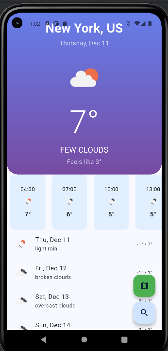

### Rainy Weather  

### Cloudy Weather  
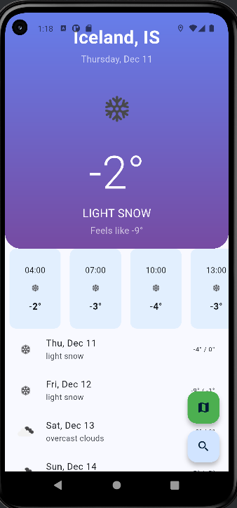

### Night Mode  
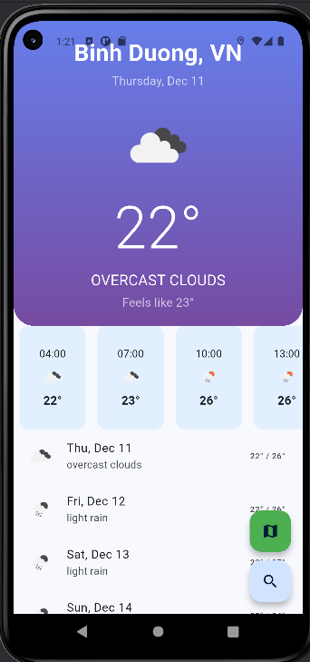

### Search Screen  

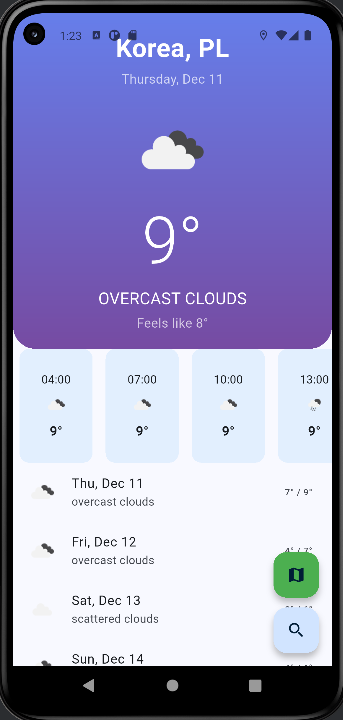

### Forecast Screen  
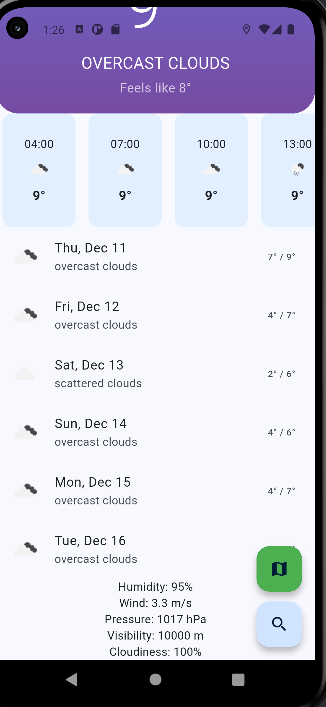

### Error State  
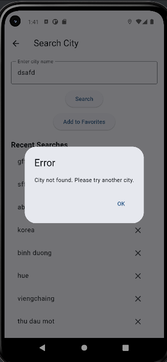

### Loading State  
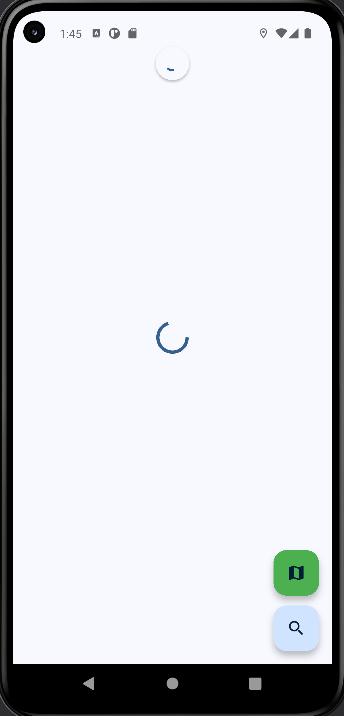

### Unit Tests  
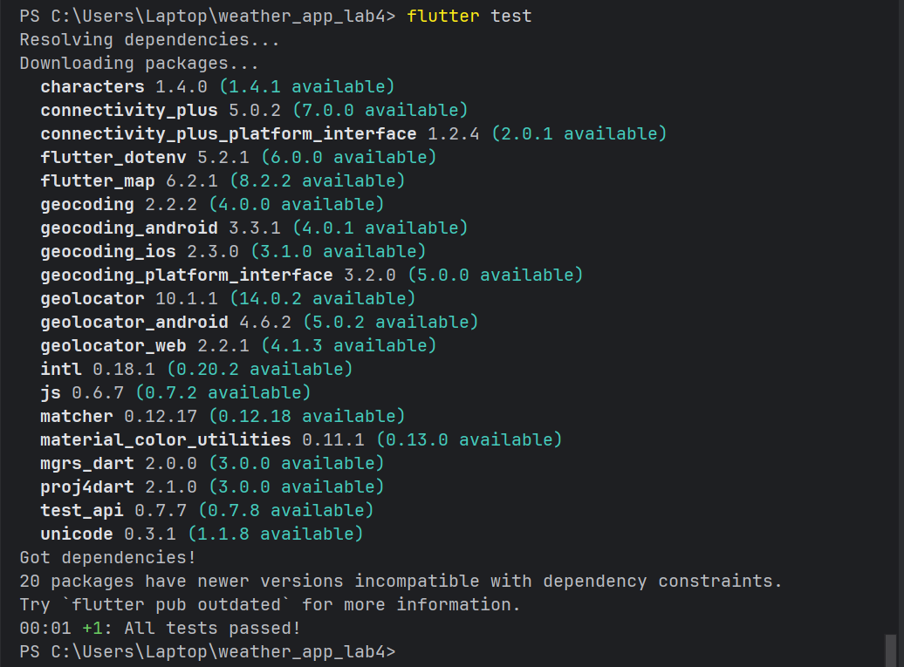

### Favorite  
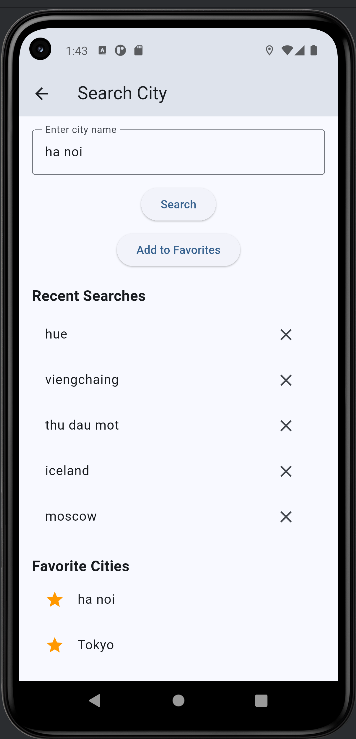

### Weather Map  
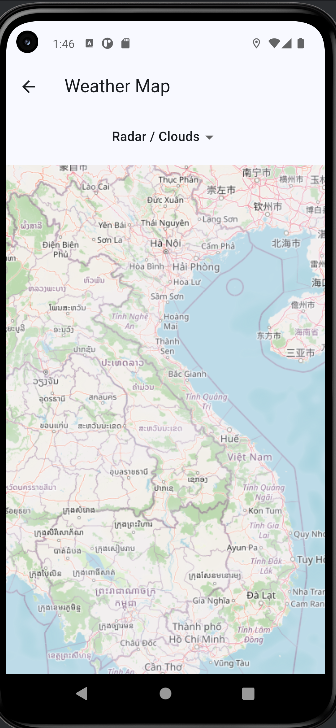

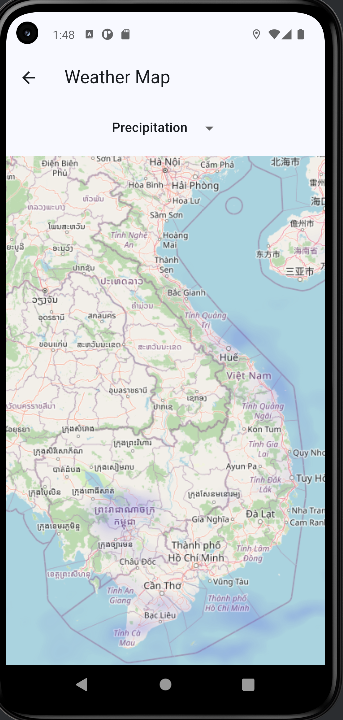

---

## Cách chạy project

### Cài đặt package
flutter pub get

### Tạo file `.env`
OPENWEATHER_API_KEY=your_api_key

### Chạy app
flutter run

---

## Unit Tests bao gồm
- Kiểm tra parse JSON  
- Kiểm tra API error  
- Widget test (smoke test)

---

## Công nghệ sử dụng
- Flutter (Dart)
- Provider
- OpenWeather API
- Geolocator
- SharedPreferences
- Google Maps
- CachedNetworkImage
- Intl

---

## Hạn chế hiện tại
- Weather Alert API có thể không hoạt động ở nhiều khu vực
- Map chưa có offline mode
- Giao diện night mode chỉ dựa vào icon API, chưa phải full theme
- Giới hạn request của OpenWeatherMap (free tier)

---

## Yêu cầu nộp bài đã đáp ứng
- API hoạt động  
- Location service  
- Search  
- Offline caching  
- Forecast  
- Error handling  
- Loading state  
- Pull-to-refresh  
- Settings screen  
- Không chứa API key  
- Có `.env.example`  
- Đầy đủ screenshot  
- Test case đã viết  

---